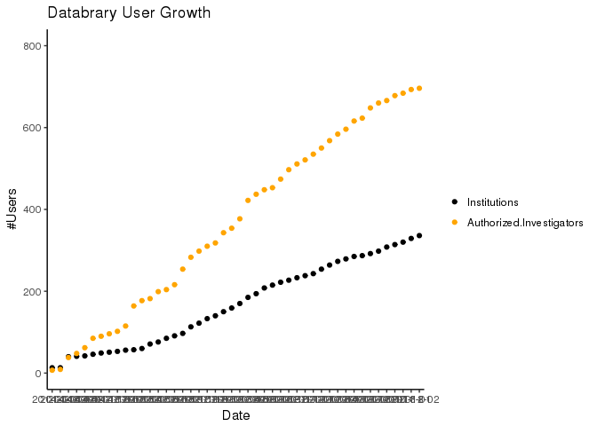
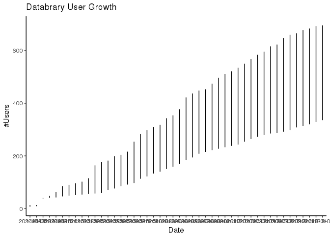

databrary-user-growth
================
Andrea R. Seisler
2018-03-14 13:28:21

Background
----------

This document contains data and graphs related to Databrary institution and user growth.

Load Libraries
--------------

``` r
#Load Libraries
library(ggplot2)
library(reshape2)
library(dplyr)
```

    ## 
    ## Attaching package: 'dplyr'

    ## The following objects are masked from 'package:stats':
    ## 
    ##     filter, lag

    ## The following objects are masked from 'package:base':
    ## 
    ##     intersect, setdiff, setequal, union

``` r
library(knitr)
```

Import data
-----------

Here we import the data file found in `csv/institutionAuthCounts.csv`, include `YearMonth`, `Institutions`, and `Authorized Investigators` in dataframe (df).

``` r
# Import data and clean

df <- read.csv(file = "csv/institutionAuthCounts.csv", header = TRUE)

# Remove extra characters from df$YearMonth
df$YearMonth <- substr(df$YearMonth, 2, 8)
```

Plot of User Growth
-------------------

Here we plot all authorized Institutions and Investigators vs. date

``` r
# Plot for all Institutions and Authorized Investigators vs. date

# the below code needs to be changed to geom_line

# Reshape df
df.melt <- melt(df, id = "YearMonth")

# Using Points
p <- 
  ggplot(data=df.melt, aes(x= YearMonth, y = value, color = variable)) +
  geom_point() +  
  theme_classic() +
  scale_colour_manual(values=c("black", "orange")) +
  ylab("#Users") +
  xlab("Date") +
  labs(title="Databrary User Growth") +
  theme(legend.title=element_blank()) +
  scale_y_continuous(limits = c(0, 800)) #+
  #scale_x_continuous(breaks=seq(df$YearMonth[1],df$YearMonth[46], 12))
p
```



``` r
# Using geom_line - not working as expected 
p2 <- 
  ggplot(data=df.melt, aes(x= YearMonth, y = value)) +
  geom_line() +
  scale_colour_manual(values=c("black", "orange")) +
  theme_classic() +
  ylab("#Users") +
  xlab("Date") +
  labs(title="Databrary User Growth")

p2
```



Questions
---------

#### How do I create the pretty file with the code and plots so it is viewable?

-   Knit to github document?
