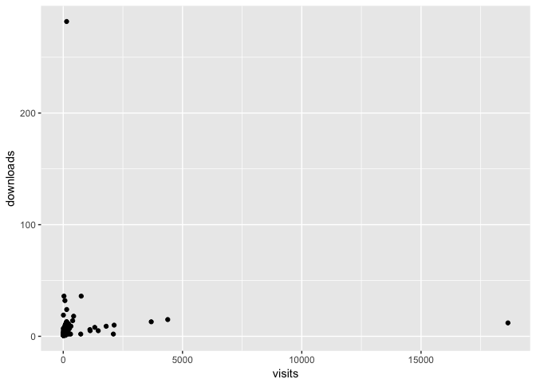
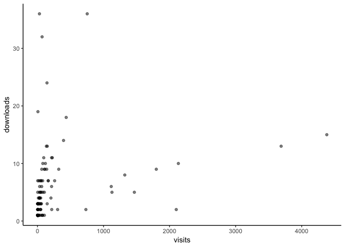

visits-downloads
================
Rick Gilmore
2018-03-26 07:28:11

-   [Purpose](#purpose)
-   [Import data sets, merge](#import-data-sets-merge)
-   [Plot visits by downloads](#plot-visits-by-downloads)
-   [Table of all downloads and visits](#table-of-all-downloads-and-visits)
-   [Top 20 downloads and volume owners](#top-20-downloads-and-volume-owners)

Purpose
-------

This document summarizes the downloads and visits data from Databrary. The input files were generated in March 2018 for the March 26, 2018 Advisory Board meeting.

Import data sets, merge
-----------------------

``` r
down <- read.csv("csv/distinctUsersPerVolume.csv")
visit <- read.csv("csv/uniqueUserCountOfAssetDownloadsByVolume.csv")

names(visit) <- c("volume", "visits")
names(down) <- c("volume", "downloads")

visit.down <- left_join(visit, down)
```

    ## Joining, by = "volume"

Plot visits by downloads
------------------------

``` r
visit.down %>%
  filter(!is.na(downloads)) %>%
  ggplot() +
  aes(x = visits, y = downloads) +
  geom_point()
```



This looks like we have a few outliers with high numbers of visits and one with a high number of downloads, but the rest fall into two groups.

``` r
visit.down %>%
  filter(!is.na(downloads)) %>%
  filter(visits < 5000, downloads < 50) %>%
  ggplot() +
  aes(x = visits, y = downloads) +
  geom_point(alpha = .5) +
  theme_classic()
```



Table of all downloads and visits
---------------------------------

``` r
visit.down %>%
  filter(!is.na(downloads)) %>%
  knitr::kable()
```

|  volume|  visits|  downloads|
|-------:|-------:|----------:|
|       9|   18643|         12|
|     239|    4380|         15|
|     272|    3689|         13|
|     209|    2133|         10|
|     326|    2101|          2|
|     324|    1799|          9|
|     336|    1467|          5|
|      73|    1322|          8|
|      77|    1128|          5|
|     473|    1117|          6|
|     112|     753|         36|
|     554|     733|          2|
|       1|     435|         18|
|       2|     395|         14|
|      70|     322|          9|
|      44|     305|          2|
|      81|     260|          7|
|      75|     225|         11|
|     241|     216|          2|
|      49|     214|         11|
|      34|     214|          6|
|     193|     204|          4|
|       8|     164|          7|
|      27|     162|          7|
|       4|     149|         13|
|     330|     147|          3|
|     235|     144|         24|
|      30|     141|        282|
|      31|     140|          9|
|     108|     135|         13|
|      38|     120|         10|
|       5|     113|          9|
|     236|     105|          1|
|     254|     105|          5|
|      46|     104|          9|
|      29|      95|         11|
|      15|      83|          5|
|     214|      81|         10|
|       7|      79|          7|
|     471|      79|          1|
|     365|      76|          1|
|      99|      70|         32|
|     232|      66|          1|
|     252|      65|          9|
|      28|      64|          6|
|      98|      61|          5|
|      61|      60|          3|
|      42|      56|          7|
|      24|      56|          7|
|      37|      51|          2|
|      53|      50|          3|
|      62|      49|          4|
|      45|      49|          3|
|      36|      48|          5|
|     137|      45|          1|
|     192|      44|          2|
|     159|      43|          2|
|      64|      43|          5|
|     165|      39|          7|
|      35|      37|          4|
|      10|      33|          6|
|      16|      32|          4|
|      79|      30|         36|
|      33|      30|          5|
|      47|      29|          4|
|      23|      29|          3|
|      96|      28|          4|
|      50|      28|          4|
|      65|      27|          3|
|      89|      23|          1|
|      51|      21|          3|
|     203|      21|          1|
|      43|      20|          7|
|      86|      19|          3|
|     160|      18|          1|
|     176|      17|          1|
|     297|      16|          2|
|      88|      16|          1|
|     178|      14|          1|
|      32|      14|          4|
|     228|      13|          1|
|      83|      11|          1|
|     430|      10|          2|
|     101|       9|          3|
|     546|       8|          1|
|     136|       8|          1|
|     223|       7|          1|
|     212|       7|          1|
|     390|       7|         19|
|      67|       6|          1|
|     118|       5|          2|
|     481|       5|          1|
|     208|       5|          2|
|     244|       5|          1|
|     357|       5|          3|
|     584|       4|          1|
|     188|       4|          1|
|     497|       4|          1|
|     234|       4|          7|
|      40|       4|          5|
|     389|       4|          3|
|     442|       3|          2|
|     115|       3|          3|
|     121|       3|          1|
|     133|       3|          1|
|     210|       3|          1|
|     270|       3|          3|
|     308|       3|          1|
|     351|       3|          1|
|     355|       3|          1|
|     545|       3|          3|
|     230|       2|          1|
|     138|       2|          1|
|     107|       2|          1|
|     468|       2|          1|
|     104|       2|          1|
|     564|       2|          1|
|     303|       2|          1|
|     482|       2|          2|
|     338|       2|          1|
|     343|       1|          1|
|     352|       1|          1|
|     356|       1|          1|

Top 20 downloads and volume owners
----------------------------------

``` r
list_volume_owners <- function(volume) {
  v <- databraryapi::download_containers_records(volume)
  if (!is.null(v$owners)) {
    owners <- v$owners$id
    if (length(owners) > 1) {
      l <- lapply(owners, download_party)
      Reduce(function(x,y) merge(x, y, all=TRUE), l) ->
      p
    } else {
      p <- as.data.frame(download_party(owners))
    }
    # Drop "Staff" etc.
    p <- p %>%
      mutate(person.id = id) %>%
      filter (!(is.na(prename))) %>%
      select(volume, person, sortname, prename, affiliation)
    return(p)
  } else {
    return(NULL)
  }
}
```

Here's a table of the top downloads.

``` r
vs <- head(visit.down, n.tops)$volume
```

It would be great to merge this table with information from Databrary. Let's see if we can do that.

``` r
list_volume_owners <- function(volume) {
  v <- databraryapi::download_containers_records(volume)
  if (!is.null(v$owners)) {
    owners <- v$owners$id
    if (length(owners) > 1) {
      l <- lapply(owners, databraryapi::download_party)
      Reduce(function(x,y) merge(x, y, all=TRUE), l) ->
        p
    } else {
      p <- as.data.frame(databraryapi::download_party(owners))
    }
    # Drop "Staff" etc.
    p <- p %>%
      mutate(person.id = id, volume = volume) %>%
      filter (!(is.na(prename))) %>%
      select(volume, person.id, sortname, prename)
    return(p)
  } else {
    return(NULL)
  }
}

top.n.visits <- head(visit.down, n.tops)
assoc.vols <- Reduce(function(x,y) merge(x, y, all=TRUE), lapply(top.n.visits$volume, list_volume_owners))
top.n.visits.vols <- left_join(assoc.vols, top.n.visits)
```

    ## Joining, by = "volume"

``` r
top.n.visits.vols %>%
  arrange(desc(visits)) %>%
  knitr::kable()
```

|  volume|  person.id| sortname      | prename         |  visits|  downloads|
|-------:|----------:|:--------------|:----------------|-------:|----------:|
|       9|          5| Adolph        | Karen           |   18643|         12|
|     239|         82| LoBue         | Vanessa         |    4380|         15|
|     239|        538| Oakes         | Lisa            |    4380|         15|
|     239|        650| Casasola      | Marianella      |    4380|         15|
|     272|        252| Scherf        | Kathryn Suzanne |    3689|         13|
|     272|        525| Motta-Mena    | Natalie V.      |    3689|         13|
|     209|        624| Horst         | Jessica S.      |    2133|         10|
|     326|        376| Bahrick       | Lorraine E.     |    2101|          2|
|     324|          6| Gilmore       | Rick O.         |    1799|          9|
|     324|        378| Norcia        | Anthony M.      |    1799|          9|
|     324|       3043| LIU           | YANXI           |    1799|          9|
|     336|        376| Bahrick       | Lorraine E.     |    1467|          5|
|      73|          6| Gilmore       | Rick O.         |    1322|          8|
|      73|        437| Seisler       | Andrea R.       |    1322|          8|
|      77|          6| Gilmore       | Rick O.         |    1128|          5|
|      77|        378| Norcia        | Anthony M.      |    1128|          5|
|     473|          6| Gilmore       | Rick O.         |    1117|          6|
|     112|        126| Fausey        | Caitlin M.      |     753|         36|
|     112|        161| Smith         | Linda B.        |     753|         36|
|     112|        254| Jayaraman     | Swapnaa         |     753|         36|
|     554|       2738| Cirelli       | Laura           |     733|          2|
|     554|       2854| Trehub        | Sandra E        |     733|          2|
|       1|          5| Adolph        | Karen           |     435|         18|
|       1|          6| Gilmore       | Rick O.         |     435|         18|
|       2|          6| Gilmore       | Rick O.         |     395|         14|
|      70|        332| Baker         | David           |     322|          9|
|      44|        279| Naigles       | Letitia         |     305|          2|
|      81|          6| Gilmore       | Rick O.         |     260|          7|
|      81|        160| Raudies       | Florian         |     260|          7|
|      81|        161| Smith         | Linda B.        |     260|          7|
|      81|        254| Jayaraman     | Swapnaa         |     260|          7|
|     595|          5| Adolph        | Karen           |     247|         NA|
|     596|          5| Adolph        | Karen           |     244|         NA|
|     596|         11| Tamis-LeMonda | Catherine       |     244|         NA|
|      75|          6| Gilmore       | Rick O.         |     225|         11|
